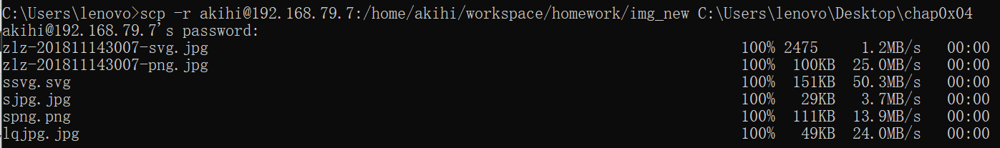
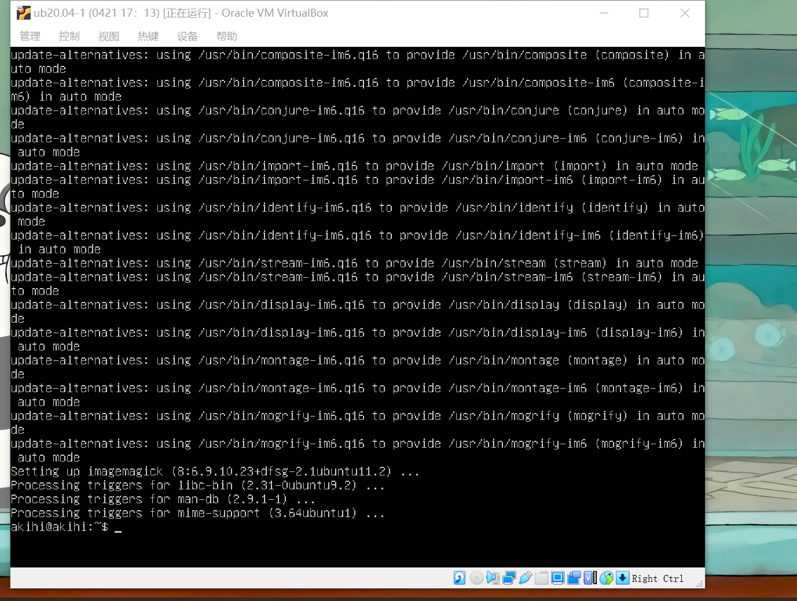

# 实验四——实验报告

## 实验环境

- Ubuntu 20.04
- virtualbox
- bash
- imagemagick

## 实验过程

#### 安装imagemagick

```bash
sudo apt update && sudo apt install imagemagick
```

### 任务一：

#### 用bash编写一个图片批处理脚本，实现以下功能：

- 支持命令行参数方式使用不同功能

- 支持对指定目录下所有支持格式的图片文件进行批处理

- 支持以下常见图片批处理功能的单独使用或组合使用

  - 查看帮助文件

    ```bash
    bash imagemagick.sh -h
    
    # 脚本为对指定文件夹下图片进行批处理
    # -a file_folder 对jpeg格式图片进行图片质量压缩
    # -b file_folder 对jpeg/png/svg格式图片在保持原始宽高比的前提下压缩分辨率
    # -c file_folder 对图片批量添加水印
    # -d file_folder 批量重命名
    # -e file_folder png/svg图片统一转换为jpg格式图片
    ```

  - 支持对jpeg格式图片进行图片质量压缩

    ```bash
    bash imagemagick.sh -a img/
    ```

  - 支持对jpeg/png/svg格式图片在保持原始宽高比的前提下压缩分辨率

    ```bash
    bash imagemagick.sh -b img/
    ```

  - 支持对图片批量添加自定义文本水印

    ```bash
    bash imagemagick.sh -c img/
    ```

  - 支持批量重命名（统一添加文件名前缀或后缀，不影响原始文件扩展名）

    ```bash
    bash imagemagick.sh -d img/
    ```

  - 支持将png/svg图片统一转换为jpg格式图片

    ```bash
    bash imagemagick.sh -e img/
    ```

#### 查看文件所在目录

```cmd
pwd 
# 发现路径为 ‘/home/akihi/workspace/homework’
```

#### 将文件从虚拟机抓取到宿主机




### 任务二：

#### 用bash编写一个文本批处理脚本，对以下附件分别进行批量处理完成相应的数据统计任务：

- [2014世界杯运动员数据](worldcup_data.md)

  - 查看帮助文件

    ```bash
    bash worldcup.sh -h
    
    # -s                 统计不同年龄区间范围（20岁以下、[20-30]、30岁以上）的球员数量、百分比
    # -p                 统计不同场上位置的球员数量、百分比
    # -n                 名字最长的球员是谁？名字最短的球员是谁？
    # -a                 年龄最大的球员是谁？年龄最小的球员是谁？
    ```

  - 统计不同年龄区间范围（20岁以下、[20-30]、30岁以上）的球员**数量**、**百分比**

    ```bash
    bash worldcup.sh -s
    ```

  - 统计不同场上位置的球员**数量**、**百分比**

    ```bash
    bash worldcup.sh -p
    ```

  - 名字最长的球员是谁？名字最短的球员是谁？

    ```bash
    bash worldcup.sh -n
    ```

  - 年龄最大的球员是谁？年龄最小的球员是谁？

    ```bash
    bash worldcup.sh -a
    ```
  
  ### [源代码](codes/worldcup_code.md)

#### 用bash编写一个文本批处理脚本，对以下附件分别进行批量处理完成相应的数据统计任务：

- [Web服务器访问日志](web_data.md)

  - 查看帮助文件

    ``` bash
    bash web.sh -h
    
    # -o      统计访问来源主机TOP 100和分别对应出现的总次数
    # -i      统计访问来源主机TOP 100 IP和分别对应出现的总次数
    # -u      统计最频繁被访问的URL TOP 100
    # -c      统计不同响应状态码的出现次数和对应百分比
    # -f      分别统计不同4XX状态码对应的TOP 10 URL和对应出现的总次数
    # -s URL  给定URL输出TOP 100访问来源主机
    ```

  - 统计访问来源主机TOP 100和分别对应出现的总次数

    ``` bash 
    bash web.sh -o
    ```

  - 统计访问来源主机TOP 100 IP和分别对应出现的总次数

    ```bash 
    bash web.sh -i
    ```

  - 统计最频繁被访问的URL TOP 100

    ``` bash
    bash web.sh -u
    ```

  - 统计不同响应状态码的出现次数和对应百分比

    ```bash 
    bash web.sh -c
    ```

  - 分别统计不同4XX状态码对应的TOP 10 URL和对应出现的总次数

    ```bash
    bash web.sh -f
    ```

  - 给定URL输出TOP 100访问来源主机

    ```bash 
    bash web.sh -s URL
    ```

### [源代码](codes/web_code.md)

## 问题与解决

#### 安装imagemagick报错


解决方法：

执行

```
sudo apt-add-repository -r ppa:zanchey/asciinema
```

后，再次执行安装语句



## 参考资料

